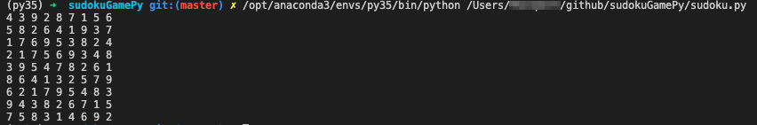
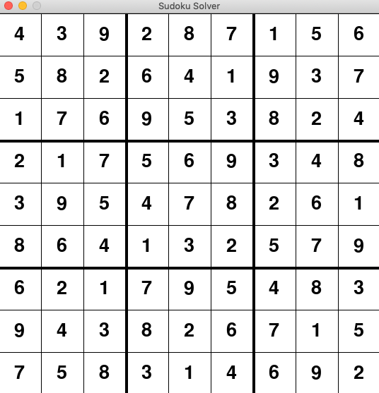

# Solve Sudoku Game

I'm using [backtracking algorthim](https://en.wikipedia.org/wiki/Backtracking) to solve the game and [Anaconda3](https://www.anaconda.com/distribution/) for my python environment. 

The code is separated into 2 different parts. You can run either code to get the outcome of the game in a terminal or GUI:

1. `Sudoku.py` - Inside this code you will find a table with the sudoku game it will need to solve. You may edit this and input a "0"(zero) for any blank spot in the sudoku board. 

```
table = [
    [0,3,0,2,8,7,0,5,0],
    [5,8,0,6,4,1,9,0,0], 
    [1,0,6,9,0,0,0,2,4], 
    [2,0,0,0,6,0,3,0,8], 
    [0,9,5,0,7,0,2,6,0], 
    [8,0,4,0,3,0,0,0,9], 
    [6,2,0,0,0,5,4,0,3], 
    [0,0,3,8,2,6,0,1,5], 
    [0,5,0,3,1,4,0,9,0]
    ]
```
Once executed, the code will use [backtracking algorthim](https://en.wikipedia.org/wiki/Backtracking) to verify that each row, column, and cube (3x3) contains unique values 1-9. 

Once the table is complete, the outcome will be printed in the terminal. Such as the following:



2. `BoardGui.py` - This code will help display the outcome of the sudoku game to a friendly GUI. I am using [Pygame](https://www.pygame.org/docs/) to create the GUI.

The sudoku table exists within this file. You may update the table to solve your specific sudoku problem. Place a "0"(zero) for any empty spots. 

Once executed, it will send the table to `sudoku.py` to solve it. Once it is solved, the full table is returned and displayed in a GUI. 

Example below:
